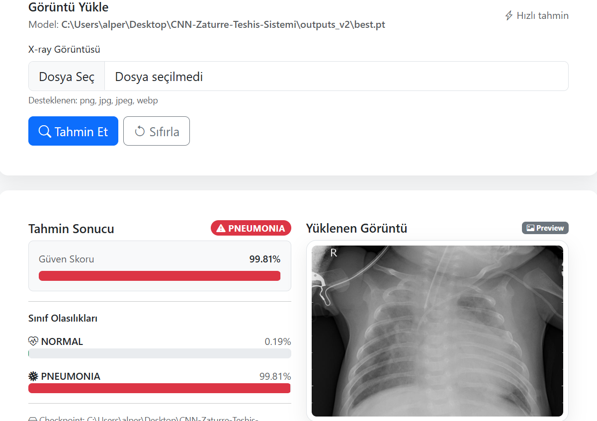
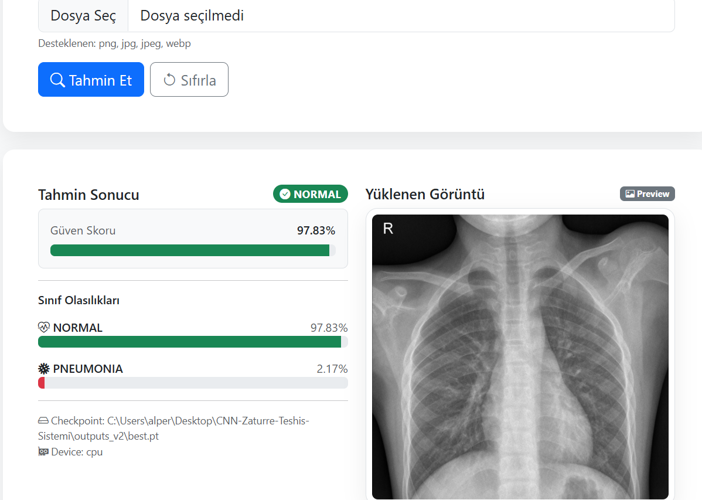

# CNN Zatürre Teşhis Sistemi (Chest X-Ray)

Göğüs röntgeni (**Chest X-Ray**) görüntülerinden **Zatürre (Pneumonia)** tespiti yapan bir derin öğrenme projesi.

Bu repo:
- **PyTorch** ile eğitilen bir CNN sınıflandırma modeli
- Tek görüntü üzerinden **inference** (tahmin)
- Basit bir **Flask + HTML** arayüzü (görsel yükle -> tahmin al)

## Görseller

Arayüz ekran görüntüsü ve değerlendirme çıktıları burada gösterilir.

### Flask arayüz (PNEUMONIA örneği)



### Flask arayüz (NORMAL örneği)



## İçindekiler

- [Özellikler](#özellikler)
- [Teknolojiler](#teknolojiler)
- [Veri Seti](#veri-seti)
- [Kurulum](#kurulum)
- [Hızlı Başlangıç](#hızlı-başlangıç)
- [Eğitim (Training)](#eğitim-training)
- [Test Değerlendirme](#test-değerlendirme)
- [Tek Görüntü Tahmini](#tek-görüntü-tahmini)
- [Flask Arayüz](#flask-arayüz)
- [Konfigürasyon](#konfigürasyon)
- [Proje Yapısı](#proje-yapısı)
- [Sonuçlar](#sonuçlar)
- [Roadmap](#roadmap)
- [Notlar](#notlar)

## Özellikler

- **Binary sınıflandırma**: `NORMAL` / `PNEUMONIA`
- **Fine-tuning** akışı (varsayılan: `resnet18`)
- **Checkpoint** kaydı (en iyi / son model)
- **Değerlendirme çıktıları**:
  - Confusion Matrix
  - ROC-AUC için `y_true` ve `y_prob` kayıtları
- **Threshold** desteği (yanlış pozitifleri azaltmak için)
- **Web demo**: tarayıcıdan görsel yükleyip tahmin alma

## Teknolojiler

- Python
- PyTorch
- Flask
- NumPy / Matplotlib (değerlendirme ve görselleştirme)

## Veri Seti

Bu projede Kaggle üzerinde yaygın olarak kullanılan **Chest X-Ray (Pneumonia)** veri seti formatı kullanılır.

### Sınıflar

- `NORMAL`: Sağlıklı göğüs röntgeni
- `PNEUMONIA`: Zatürre bulgusu içeren göğüs röntgeni

### Split (Train/Val/Test)

Model eğitimi için veri üçe ayrılır:

- `train`: eğitim
- `val`: doğrulama (erken durdurma ve en iyi model seçimi)
- `test`: final değerlendirme

Klasör yapısı aşağıdaki gibi beklenir:

```
chest_xray/
  train/
    NORMAL/
    PNEUMONIA/
  val/
    NORMAL/
    PNEUMONIA/
  test/
    NORMAL/
    PNEUMONIA/
```

Not: Veri setini repoya eklemek yerine yerelde bu yapıda konumlandırman önerilir.

### Veri seti dağılımı (görsel)

`assets/dataset_distribution.png` grafiği, her split içindeki sınıf örnek sayılarını gösterir.

## Kurulum

## Gereksinimler

- Python 3.9+ (önerilir)
- (Opsiyonel) NVIDIA GPU + CUDA (eğitimi hızlandırmak için)

### 1) Sanal ortam (önerilir)

Windows PowerShell:

```powershell
python -m venv .venv
.\.venv\Scripts\Activate.ps1
```

### 2) Bağımlılıklar

```powershell
pip install -r requirements.txt
```

> Not: `torch` kurulumu CPU/GPU durumuna göre değişebilir. Eğer Torch kurulumu hata verirse, CUDA/CPU’ya uygun kurulumu ayrıca yapabiliriz.

## Hızlı Başlangıç

- **Eğit**:

```powershell
python train.py --data-dir chest_xray --output-dir outputs_v2 --arch resnet18 --epochs 12 --batch-size 16 --lr 1e-4 --freeze-epochs 2 --patience 4
```

- **Test et**:

```powershell
python evaluate.py --data-dir chest_xray --checkpoint outputs_v2/best.pt --out-dir outputs_v2
```

- **Web arayüzünü çalıştır**:

```powershell
python app.py
```

Tarayıcı:
- `http://127.0.0.1:5000`

## Eğitim (Training)

Varsayılan olarak `resnet18` kullanır.

## Model Mimarisi

### Transfer Learning (ResNet18 / EfficientNet-B0)

Model omurgası **ImageNet** ile ön-eğitilmiş bir CNN’dir.

- **Backbone**: `resnet18` (varsayılan) veya `efficientnet_b0`
- **Classifier head**: Son katman, 2 sınıf için yeniden tanımlanır (`NORMAL`, `PNEUMONIA`)

### Eğitim Stratejisi

- **Augmentation**: `RandomResizedCrop`, `RandomAffine`, `RandomHorizontalFlip`
- **Fine-tuning (2 aşama)**:
  - İlk `freeze-epochs` epoch: backbone dondurulur, sadece head öğrenir
  - Sonra backbone açılır ve daha düşük LR ile fine-tune edilir
- **Optimizer**: `AdamW`
- **Scheduler**: `ReduceLROnPlateau` (izlenen metrik: `val_macro_f1`)
- **Model seçimi**: `best.pt` kaydı **validation macro-F1** en yüksek olduğunda güncellenir
- **Early stopping**: `--patience` kadar iyileşme yoksa eğitim durur

Önerilen “fine-tuning” ayarları (daha iyi genelleme için):

```powershell
python train.py --data-dir chest_xray --output-dir outputs_v2 --arch resnet18 --epochs 12 --batch-size 16 --lr 1e-4 --freeze-epochs 2 --patience 4
```

Eğitim çıktıları:
- `outputs_v2/best.pt`: validation **macro-F1**’e göre en iyi model
- `outputs_v2/last.pt`: son epoch modeli
- `outputs_v2/metrics.jsonl`: epoch bazlı metrikler

### Eğitim grafikleri nasıl üretilir?

Eğitim eğrileri (loss/accuracy/macro-F1/LR) için:

```powershell
python make_report_assets.py --run-dir outputs_v2 --data-dir chest_xray --assets-dir assets
```

Bu komut aşağıdaki görselleri üretir:

- `assets/training_curves.png`
- `assets/dataset_distribution.png`
- (Eğer `outputs_v2` içinde varsa) `assets/confusion_matrix.png`, `assets/roc_curve.png`

## Test Değerlendirme

```powershell
python evaluate.py --data-dir chest_xray --checkpoint outputs_v2/best.pt --out-dir outputs_v2
```

Üretilen dosyalar:
- `outputs_v2/confusion_matrix.png`
- `outputs_v2/confusion_matrix.npy`
- `outputs_v2/y_true.npy`
- `outputs_v2/y_prob.npy`

## Başarı Metrikleri (Rapor)

Bu proje aşağıdaki metrikleri raporlar:

- **Accuracy**: Toplam doğruluk
- **Precision / Recall / F1-score**: Sınıf bazlı performans
- **Macro-F1**: Sınıfları dengeli değerlendirmek için (validation’da model seçimi)
- **Confusion Matrix**: Hata tiplerini görselleştirir
- **ROC-AUC**: Özellikle `PNEUMONIA` için olasılık kalitesini ölçer

Bu metriklerin görsel çıktıları `assets/` altında gösterilmiştir.

### Threshold ile karar (opsiyonel)

Yanlış “PNEUMONIA” alarmını azaltmak için threshold deneyebilirsin:

```powershell
python evaluate.py --data-dir chest_xray --checkpoint outputs_v2/best.pt --out-dir outputs_v2 --threshold 0.7
```

## Tek Görüntü Tahmini

```powershell
python predict.py --image "chest_xray/test/PNEUMONIA/person1_virus_6.jpeg" --checkpoint outputs_v2/best.pt
```

## Flask Arayüz

### Çalıştırma

```powershell
python app.py
```

Tarayıcı:
- `http://127.0.0.1:5000`

## Konfigürasyon

### Checkpoint seçmek (opsiyonel)

Varsayılan checkpoint:
- `outputs_v2/best.pt`

Farklı checkpoint ile çalıştırmak için ortam değişkeni:

```powershell
$env:CHECKPOINT="C:\Users\alper\Desktop\CNN-Zaturre-Teshis-Sistemi\outputs_v2\best.pt"
python app.py
```

## Proje Yapısı

- `chest_xray/`
  - `train/` -> `NORMAL/`, `PNEUMONIA/`
  - `val/` -> `NORMAL/`, `PNEUMONIA/`
  - `test/` -> `NORMAL/`, `PNEUMONIA/`
- `train.py`: eğitim + validation + checkpoint
- `evaluate.py`: test değerlendirme + confusion matrix + ROC-AUC
- `predict.py`: tek görüntü ile tahmin
- `app.py`: Flask arayüz (upload -> predict)
- `templates/index.html`: arayüz sayfası
- `requirements.txt`

## Sonuçlar

Bu bölümde kendi deney sonuçlarını paylaşman için alan:
- Kullanılan model / epoch / öğrenme oranı
- Test metrikleri (Accuracy, Macro-F1, ROC-AUC)
- Confusion Matrix görseli: `outputs_v2/confusion_matrix.png`

## Roadmap

- Daha güçlü mimariler (`resnet34`, `efficientnet` vb.)
- Class imbalance için weighted loss / focal loss
- Model açıklanabilirliği (Grad-CAM)
- Basit bir API endpoint (JSON input/output)


